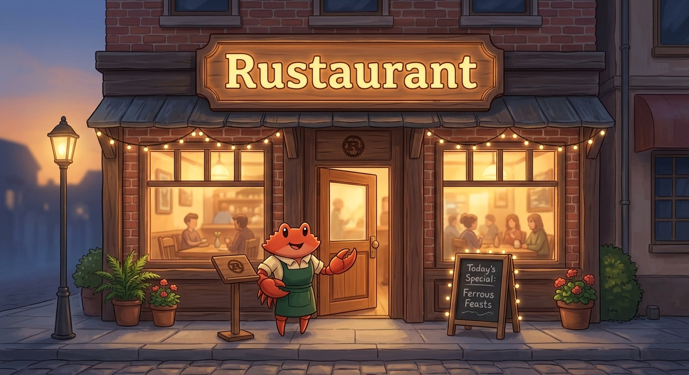

# Rustaurant


`Rustaurant` is a small console-based restaurant simulator written in Rust.

It was built as a learning project to practice core Rust concepts through a simple tick-based simulation, with an emphasis on clarity, modularity, and incremental development.

Key concepts explored:
- Rust modules and project structure
- structs and enums
- `Option` and `Result`
- loops, `if`, and `match`
- ownership and mutable state
- incremental development without overengineering

## Overview

The simulator operates in discrete ticks rather than real time.

Each tick represents a single simulation step:
- new guests may arrive
- tables progress toward becoming free
- waiting groups may be seated automatically

This approach keeps the system deterministic and easier to reason about.

## Current Features

- open and close the restaurant via console
- simulate a workday using a tick-based loop
- seat guest groups at suitable free tables
- keep groups in a waiting queue when no table is available
- free tables after a fixed number of ticks
- auto-seat queued groups using a strict FIFO policy
- assign unique IDs to guest groups
- reopen the restaurant or exit the program

## Project Structure

```text
src/
├── main.rs
└── restaurant/
    ├── mod.rs
    ├── model.rs
    ├── logic.rs
    └── ui.rs
```

- `main.rs` starts the application and runs the top-level flow
- `restaurant/model.rs` contains the core data structures
- `restaurant/logic.rs` contains the simulation rules
- `restaurant/ui.rs` contains console input/output

## Queue Policy

The current MVP uses a strict FIFO queue:
- only the first waiting group is considered for seating
- if that group cannot be seated, later groups continue waiting
- if the first group can be seated, the simulator keeps processing the queue while seating remains possible

This behavior is intentional for the initial version. More flexible seating strategies may be introduced in future iterations.

## Design Notes

The simulator uses ticks instead of real-time execution.

This keeps the program deterministic, easier to reason about, and better suited for learning core Rust concepts before introducing more advanced features such as async workflows or concurrency.

This design allows future extensions (such as async workflows or concurrent systems) to be introduced incrementally without rewriting the core logic.

## Run

Requirements:
- Rust toolchain installed

Commands:

```bash
cargo run
```

Optional checks:

```bash
cargo check
```

## Example Flow

1. Open the restaurant.
2. Advance through ticks.
3. Add arriving guest groups.
4. Seat them immediately or place them in the queue.
5. Let tables become free and auto-seat waiting groups.
6. Close the restaurant at the end of the workday.

## Roadmap

Future improvements:

- smarter queue seating strategies beyond strict FIFO
- support for combining compatible free tables to accommodate larger guest groups
- a kitchen subsystem where order preparation advances one tick at a time
- support for richer simulation events and restaurant states
- project updates that reflect newly learned Rust concepts, such as async workflows and concurrency
